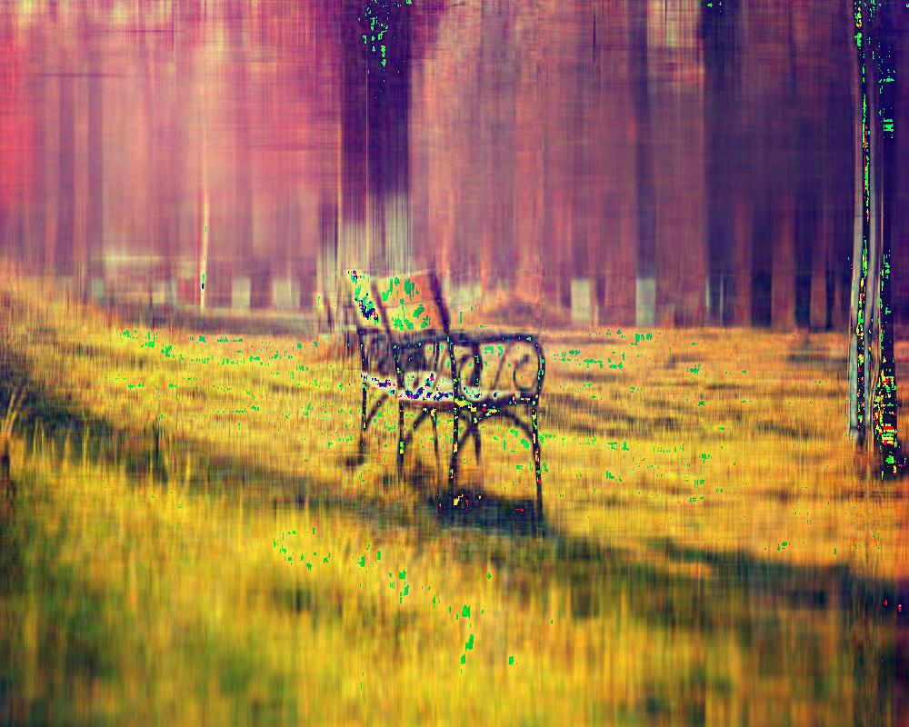

UECM3033 Assignment #2 Report
========================================================

- Prepared by: *Penny Chong*
- Tutorial Group: T2

--------------------------------------------------------

## Task 1 --  $LU$ Factorization or SOR method

The reports, codes and supporting documents are to be uploaded to Github at: 

[https://github.com/PennyChong/UECM3033_assign2](https://github.com/PennyChong/UECM3033_assign2)

**Explain your selection criteria here.**
To solve the system of linear equations, Ax=b, we need to first determine the property of the square matrix, A.  If  A is a symmetric matrix that is positive definite, then the SOR method will converge to a solution after a certain number of iterations for any initial value of X. In this case, the SOR method is preffered over LU factorization method. On the other hand if A is not a symmetric positive definite matrix, the SOR method will not converge to a solution. Hence if A is not a symmetric positive definite matrix, we will use the LU factorization technique to solve the equations. Although LU factorization technique can also be used on symmetric positive definite matrices, we prefer the SOR iterative method. LU factorization has a high computational cost  as compared to SOR.

**Explain how you implement your `task1.py` here.**
Before deciding which method to be used in solving the system of linear equations, we perform a quick check to see whether is A a symmetric positive definite matrix. The ***choice(A)*** function will first check is A a symmetric matrix. If A is not symmetric, then we can immediately conclude that the SOR method will not yield a convergent solution. Therefore, the method returns **true** and LU factorisation will be used to solve the system.  If A is symmetric, we continue to check whether is A a positive definite matrix by checking the determinant of each leading principal sub-matrices. If each determinant is greater than 0, then the function returns **false** and the SOR method will be used. Otherwise, the method LU factorization is used.

If LU factorization is used, the ***lu(A, b)*** function will call the ***LUdecomp(A)*** function to factorise A into lower and upper triangular matrices before proceeding to solve the system of equations.

If SOR method is used, the ***sor(A, b)***  function will first call the **optimalW(K)**  function to determine the optimal ω before solving the equations.

The 2 sets of system of linear equations  in this task are solved using LU factorization as A in both sets are not symmetric positive definite matrices. 

The solutions to the first set of 3-variables system of linear equations are 

\begin{align}  x_1=1,\;\;x_2=1,\;\;x_3=1.\end{align}

The solutions to the second set of 6-variables system of linear equations are 
 \begin{align}  x_1=0.99999999999999445,\;\;x_2=-1.0000000000000042,\\x_3=4.00000000000000000,\;\;x_4=-3.500000000000004,\\x_5=6.9999999999999947,\;\;x_6=-1.0000000000000002.\end{align}

To check the solutions of the system Ax=b, multiply A with x to verify that the answer is equals to b.

---------------------------------------------------------

## Task 2 -- SVD method and image compression

Put here your picture file (img1.jpg)

**How many non zero element in $\Sigma$?**
The number of non zero elements in $\Sigma$ is equivalent to the number of rows in $\Sigma$ which is 800. More generally, the number of non zero elements in $\Sigma$ is equals to the height of our image in pixels.

Put here your lower and better resolution pictures. Explain how you generate
these pictures from `task2.py`.

**Lower resolution picture:**

 First we split the original image into its red, green and blue components. For each of the component, we use the predefined ***linalg.svd()*** function from the **numpy** library to perform singular value decomposition.  To create a lower resolution picture, input **n=30** as an input parameter to the function ***reso(n,U,sigma,V)*** for all the rgb components . Only the first 30 singular values in $\Sigma$ are not replace with zeros. Since a large amount of singular values are set to zeros, there will be a drop in the quality of the image. We can see this effect by merging the newly computed rgb channels to form a coloured image as shown above.
 
**Better resolution picture:**

For a better resolution picture,  we input **n=200** rather than **n=30** as an input parameter to the predefined ***linalg.svd()*** function. Instead of only 30 singular values, we now have 200 singular values in $\Sigma$ that are not replace with zeros. Therefore, this image will be of better quality as shown above.

**What is a sparse matrix?**
A sparse matrix is a matrix where most of the elements are zero. In image compression with SVD, our  $\Sigma$ is the sparse matrix. This is because $\Sigma$ is a diagonal matrix where all the elements are zeros except for the diagonal. Hence, the sparse matrix in image compression with SVD has (N x M)-N zero elements where M and N are the width and the height of the image respectively. 

**Note:**  Since github does not render equation well, you may view report.md with
[https://stackedit.io/editor](https://stackedit.io/editor)

-----------------------------------

last modified: 11/03/2016

